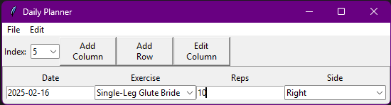

# About
Daily Planner is a simple Tkinter application written in Python. It is essentially a minimal .csv editor that auto-enters today's date and allows for certain columns to be comboboxes, where the user can easily select previous values without having to type them in again. The application can open and save to .csv, and stores the column data in the header of the .csv.
# Usage
The UI of daily planner looks like:

You can add columns, add rows, and edit columns with their respective buttons on the ribbon, as well as change the index, or which row you're viewing, with the index box. You can also access the add column, add row, and edit column commands under Edit. To open, save, or create a new file, open the File dropdown. Individual values can be edited by simply clicking in the box and typing, and comboboxes can be changed to a previous value by clicking the dropdown in its box.
