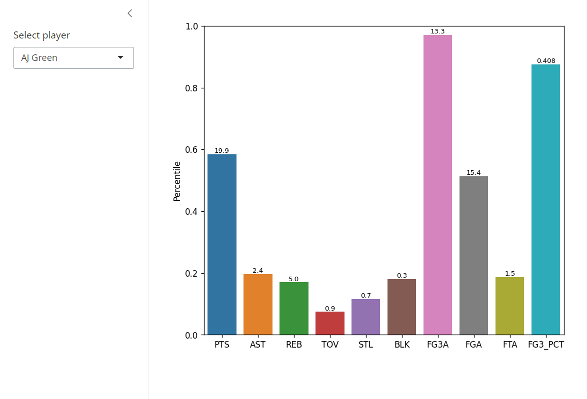

# About
This is a simple Shiny application written in Python which displays a bar graph with columns on the x-axis and their percentile on the y-axis within a population. For demonstration, the app uses NBA per 100 possession data for the 2023-24 season, where you can select any player and see where their per 100 stats lies among the greater league.
